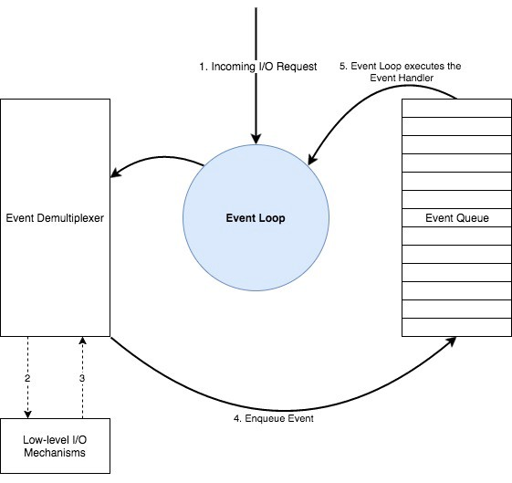
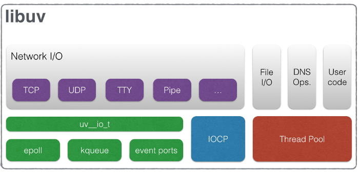

NodeJS 和其他 programming platforms 最大的不同就是 NodeJS 处理 I/O 的方式。我们经常会听到 NodeJS 是一个“基于谷歌 V8 JavaScript 引擎，非阻塞，事件驱动的运行环境”。但是这些形容词分别代表什么呢？“非阻塞”和“事件驱动”是什么意思？这些问题的答案都可以在 NodeJS 的核心，Event Loop，中找到。

## Reactor Pattern

NodeJS 以一个事件驱动的模型工作，这个模型包含了一个**Event Demultiplexer**（双向事件处理器）和一个**Event Queue**（事件队列）。所有的 I/O 请求最终都会产生一个 completion、failure 或者其他的结果，这些被称为**Event**（事件）。这些事件会被按照下面的算法处理：

1. Event Demultiplexer 会接受 I/O 请求并且将请求委派给对应的硬件。
2. 一旦 I/O 请求被处理完成（例如，来自于一个文件的数据已经准备好被读取，来自于一个 socket 的数据已经准备好被读取等等），event demultiplexer 会将对应事件的回调 handler 添加到一个队列以被执行。这个队列被称为**Event Queue**。
3. 当 event queue 中的 handlers 可以被执行的时候，它们会按照被添加的顺序执行，直到 event queue 被清空。
4. 如果 event queue 中没有 handlers 并且 Event Demultiplexer 也没有 pending 的 I/O 请求，那么程序就会结束。否则的话，重新开始从第一步执行。

而管理并运行这整个机制的程序被称为**Event Loop**。

Event Loop 是一个单线程、半无限的循环。“半无限”的原因是因为这个循环在没有更多工作需要做的时候会结束。对于程序员来说，这个时候也就是程序退出的时候。

上面这张图是 NodeJS 工作流程的 high-level overview 并且展示了**Reactor Pattern**设计模式的主要组件。但是 NodeJS 的 Event Loop 比上面这张图要复杂得多：

> Event Demultiplexer 并不是一个能够在任何 OS 处理所有 I/O 请求的组件。
>
> Event Queue 也并不是单单一个队列，包含了所有事件类型的 handlers。并且 I/O handlers 也不是唯一会被 queued 的 handler。

接下来我们一起继续深入了解。

## Event Demultiplexer

Event Demultiplexer 并不是在现实世界中存在的一个组件，而是一个 reactor pattern 设计模式中的一个抽象概念。在现实世界中，不同的 OS 对 Event Demultiplexer 有着不同的实现，在 Linux 中是**epoll**，BSD 系统（macOS）是**kqueue**，Windows 是 **IOCP（Input Output Completion Port）** 等等。NodeJS 会使用这些 OS 提供的原生、底层、非阻塞、异步、硬件 I/O 功能。

### Complexities in File I/O

但是令人非常困惑的是，并不是所有的 I/O 都可以使用这些 OS 原生功能实现。即使在同一个 OS 平台，支持不同的 I/O 类型也非常复杂。一般来说，网络 I/O 可以使用 epoll，kqueue，IOCP 来非阻塞地执行，但是文件相关的 I/O 比这复杂得多。一些系统，例如 Linux，并不支持对于文件的完全异步 access。而 macOS 的 kqueue 对于文件系统的事件的 notifications/signalling 有着很多限制。总而言之，对于文件系统的 access，并不存在着 OS 提供的原生的异步功能。

### Complexities in DNS

和文件 I/O 类似，Node API 提供的一部分 DNS 功能也有着一些限制。NodeJS 的 DNS 函数例如`dns.lookup`会获取一些系统配置文件例如`nsswitch.conf`，`resolv.conf`和`/etc/hosts`，因此上面提到的文件系统 I/O 的限制也会影响到`dns.lookup`函数。

### The solution?

因此，NodeJS 创建了一个 **thread pool（线程池）** 来支持那些不能使用 OS 原生异步 I/O API（epoll/kqueue/IOCP）完成的 I/O 功能。NodeJS 会尽量使用 OS 原生的非阻塞、异步、硬件功能来处理 I/O，而对于 OS 并不提供原生非阻塞、异步 API 的 I/O 类型，NodeJS 会使用线程池。

> 然而，I/O 并不是线程池处理的唯一请求。针对一些 highly CPU intensive 的函数，例如部分`crypto`函数和`zlib`函数，NodeJS 也会使用线程池来处理以防止阻塞 event loop。

### Gathering All Together

因为上面的这些原因，在现实生活中在不同的 OS 上支持所有的 I/O 类型是非常复杂的。一些 I/O 请求可以使用 OS 原生的硬件异步 API 来完成，而一些 I/O 请求需要在线程池中执行以保证异步执行。

> 很多 NodeJS 的开发者都认为所有的 I/O 都会在线程池中处理，这其实是一个误解。

因为这些跨 OS 和 OS 内部对不同 I/O 类型的异步原生支持的不同，存在着一个抽象层封装了所有这些跨 OS 和 OS 内部处理 I/O 的细节并为 NodeJS 的上层提供一个统一的 API。而这个抽象层就是大名鼎鼎的——**libuv**。

下面这段话来自于 libuv 的官方文档：

Libuv is a cross-platform support library which was originally written for NodeJS. It's designed around the event-driven asynchronous I/O model.

The library provides much more than a simple abstraction over different I/O polling mechanisms: 'handles' and 'streams' provide a high level abstraction for sockets and other entities; cross-platform file I/O and threading functionality is also provided, amongst other things.

现在我们来看 libuv 是如何构成的。下面的图片来自于 libuv 的官方文档并且描述了 libuv 是如何在处理不同类型的 I/O 的同时暴露一个统一的 API 的。

现在我们知道了**Event Demultiplexer**并不是一个 atomic 的个体，而是由 libuv 提供的一系列处理 I/O 的 API。libuv 不仅仅提供了 event demultiplexer 而且提供了包含了 event queuing 机制的完整 event loop。

现在我们来看看**Event Queue**。

## Event Queue

Event Queue 按理来说应该是 event loop 使用的一个按顺序 enque、deque 的数据结构，直到该数据结构被清空。但是 NodeJS 内部 Event Queue 的工作方式和抽象的 reactor pattern 描述的完全不同。

> NodeJS 中有多个 queues，对应不同的事件类型。也就是说不同的事件类型的 handlers 有各自不同的 queues。
>
> 在处理完一个 phase 之后移动到下一个 phase 之前，event loop 会执行两个中间队列直到这两个中间队列被清空。

那么存在着多少队列呢？并且中间队列又是什么呢？

Libuv event loop 原生处理的队列有 4 个：

- **Expired timers and intervals queue**——包含了使用`setInterval`和`setTimeout`添加的回调函数。
- **IO Events Queue**——包含了已经处理完成的 IO 事件的回调函数。
- **Immediates Queue**——使用`setImmediate`添加的回调函数。
- **Close Handlers Queue**——所有`close`事件的回调函数。

> 注意，尽管我们这里将所有这些数据结构称为"**Queue**"，但是它们的数据结构并不都是队列（例如，timers 被存储在 min-heap 中）。

在这 4 个队列之外，还存在着 2 个由 Node 处理的中间队列。尽管这两个队列并不是 libuv 的一部分但是却是 NodeJS 的一部分。它们是：

- **Next Ticks Queue**——包含了使用`process.nextTick`添加的回调函数。
- **Other Microtasks Queue**——包含了其他的 microtasks，例如 resolved 的 promises 的回调函数。

### How does it work?

从下面这张图可以看到，Node starts the event loop by checking for any expired timers in the timers queue, and go through each queue in each step while maintaining a reference counter of total items to be processed. After processing the close handlers queue, if there are no items to be processed in any queue and there are no pending operations, the loop will exit. The processing of each queue in the event loop can be considered as a phase of the event loop.

关于中间队列非常有趣的一点就是一个 phase 结束之后 event loop 会检查这两个中间队列。如果这两个中间队列中有需要处理的回调函数，那么 event loop 会立刻开始处理这两个中间队列中的回调直到这两个队列被清空。当它们被清空之后，event loop 会继续执行下一个 phase。

### Next tick queue vs. Other Microtasks

Next tick queue 的优先级要高于 Other Micro task queue。即在 event loop 开始执行 resolved promises 的回调之前，event loop 会先清空 next tick queue。

因为这两个中间队列的运行机制，event loop 可能会碰到 IO starvation 的问题。如果不停得有新回调函数被添加到这两个队列，那么 event loop 就会一直执行这两个队列中的回调函数。这会造成 IO starvation，因为 event loop 不能在清空这两个中间队列之前移动到下一个 phase。

