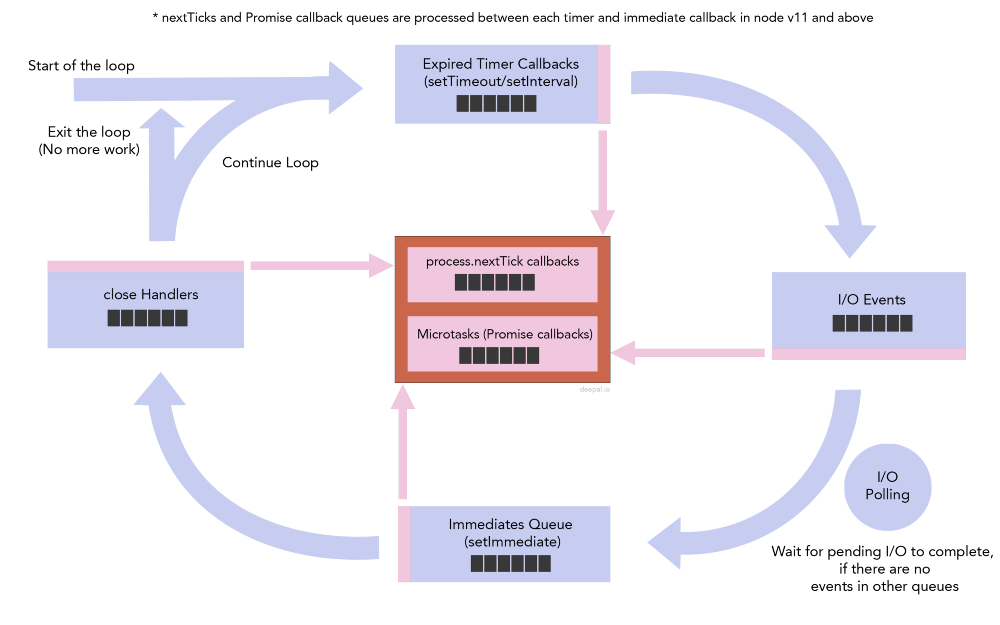

在这一篇文章中，我们讨论三个非常重要的事件回调队列。它们分别是`timers`，`immediates`和`process.nextTick`的回调队列。

## Next Tick Queue



请注意两个中间队列区别于其他四个主要队列，因为它们并不是由 libuv 原生提供的，而是由 Node 实现的。

在 event loop 执行每一个 phase 之前（timers queue，IO events queue，immediates queue，close handlers queue 是 4 个主要 phases），在进入这个 phase 之前，Node 会检查两个中间队列。如果两个队列不是空的话，Node 在进入主要 event loop phase 之前会先开始执行这两个队列中的回调函数直到这两个队列被清空。

如果我们递归地不断给这两个队列添加回调 handlers，这有可能造成 IO starvation 的问题。

## Timers Queue

当我们使用`setTimeout`或者`setInterval`添加 timer 的时候，Node 会将 timer 添加到 timers heap，libuv 内部会使用这个数据结构。在 event loop 的 timers phase，Node 会检查 timers heap 中那些 expired timers/intervals 然后会按顺序调用它们的回调函数。如果有多个同样 expiration period 的 timers expire 的话，它们会按照被 set 的顺序执行。但是不同的 expiration period 还会按照以 expiration period 以小到大的顺序执行。

当一个 timer/interval 被设置了一个 expiration period 之后，Node 并不保证该 timer 的 callback 会准确得在 expiration period 时间之后立刻执行。回调函数的调用时间取决于系统的 performance（Node 在执行 timers 回调之前必须获取当前时间以检查 expiration，而这需要花费一些时间）以及 event loop 中其他队列的情况。然而，Node 可以保证 timer 的回调函数在 expiration period 之前不会被执行。

## Immediates Queue

immediates 回调函数在 I/O phase 之后立刻执行。我们可以使用`setImmediate`给 immediates queue 添加回调函数。

### setTimeout vs. setImmediate?

通过上面的 event loop diagram，我们可以看到 event loop 会先执行 timers。之后是会执行 I/O 回调，然后是 immediates 队列。看下面的代码：

```js
setTimeout(() => {
  console.log('setTimeout');
}, 0);

setImmediate(() => {
  console.log('setImmediate');
});
```

如果你执行上面的代码会发现这个程序有时候先打印`setTimeout`但是有时候会先打印`setImmediate`。

这是因为 NodeJS 为了匹配 Chrome's timers cap，会把 minimum timeout 覆盖成 `1ms`。因为这个修正，即使我们将一个 timer 的 expiration period 设成`0ms`，实际的 delay 会被 NodeJS 覆盖为`1ms`。

At the start of a new iteration of the event loop, NodeJS invokes a system call to get the current clock time. Depending on how busy the CPU is, getting the current clock time may or may not complete within `1ms`. If the clock time is retrieved in less than `1ms`, NodeJS will detect that the timer is not expired, because the timer takes `1ms` to expire. But, if getting the clock time takes more than `1ms`, the timer will be expired by the time the clock time is retrieved. In the case of Node detecting that the timer is not yet expired, then the event loop will move on to the I/O phase and then to the immediates queue. Then it will see that there is an event in the immediates queue and it will process it. Hence, `setImmediate` preceding the `setTimeout` callback.

然后下面的代码中，immediate 回调保证会在 timer 回调之前执行：

```js
const fs = require('fs');

fs.readFile(__filename, () => {
  setTimeout(() => {
    console.log('timeout');
  }, 0);

  setImmediate(() => {
    console.log('immediate');
  });
});
```

这是因为`fs.readFile`的回调在 I/O phase 执行，I/O phase 之后会立即执行 immediates queue 的回调，所以上面的代码永远会先打印`immediate`然后才会打印`timeout`。
