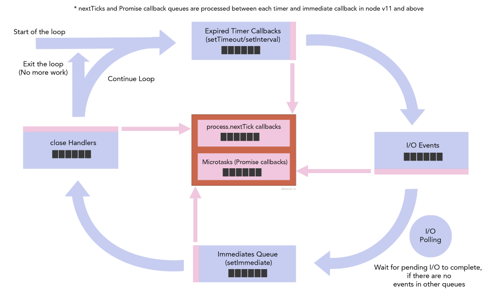

## Native Promises

原生的 promises 的回调函数是一个 microtask 并且会被放到 microtask queue，在 next tick queue 执行结束之后开始执行。

请注意，resolve/rejected promises 和`process.nextTick`的回调都是 microtasks。但是 event loop 会先执行 next tick queue 中的回调。
