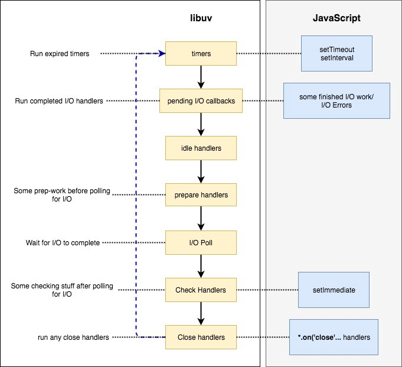

## Async I/O... Cuz blocking is too mainstream!

I/O 就不应该是 synchronous 的。

在所有的 OS 中，OS 都提供了对某些 I/O 的原生异步支持（linux 的 epoll，macOS 的 kqueue，Windows 的 IOCP 等等）。NodeJS 会使用这些 OS 原生的异步 I/O API 来提供一个非阻塞、异步的 I/O。

NodeJS 将很多不同的 utilities 集合成了一个 high performant 的 NodeJS 运行环境。这些 utilities 包括：

- Chrome v8 engine - For high-performance JavaScript evaluation
- Libuv - For Event Loop with Asynchronous I/O
- c-ares - For DNS Operations
- other add-ons such as (**http-parser**, **crypto** and **zlib**)


在这篇笔记中，我们来一起探索 Libuv 以及它是如何为 NodeJS 提供异步 I/O 的。让我们再次看一下 event loop diagram。


我们首先来回顾一下我们到目前为止已经了解的关于 event loop 的信息：

- The event loop is started with executing handlers of all expired timers.
- Then it will process any pending I/O operations, and will optionally wait for any pending I/O to complete.
- Then it will move on to consume setImmediate callbacks.
- Finally, it will process any I/O close handlers.
- Between each phase, libuv needs to communicate the results of the phase to the higher layers of Node architecture(which means JavaScript). Each time this happens, any `process.nextTick` callbacks and other microtask callbacks will be executed.

现在，我们一起来理解 NodeJS 是如何在 event loop 中来执行 I/O 的。

> What is I/O?
> Generally, any work which involves external devices except the CPU is called I/O. The most common abstract I/O types are File Operations and TCP/UDP network operations.

## Libuv and NodeJS I/O

JavaScript 本身并不提供任何功能来执行异步 I/O 操作。在 NodeJS 的开发阶段，libuv 被开发来为 NodeJS 提供异步 I/O 的功能，尽管 libuv 现在可以作为一个单独使用的库。Libuv 在 NodeJS 架构中的作用是抽象内部 I/O 操作，并为 Node 的上层提供一个统一的 API 接口。这样 Node 可以执行 platform-independent 的异步 I/O 而不用担心当前运行在什么 platform。

和上面的 NodeJS 架构图一样，libuv 位于 NodeJS 的 lower layer。现在我们来看一下 NodeJS 的上层和 libuv event loop 之间的关系图：



就和我们之前看到的 Event Loop In A Nutshell 图一样，event loop 有 4 个主要阶段。但是 libuv 内部有着 7 个主要阶段。它们分别是：

1. Timers - Expired timer and interval callbacks scheduled by `setTimeout` and `setInterval` will be invoked.
1. Pending I/O callbacks - Pending callbacks of any completed/errored I/O operation to be executed here.
1. Idle handlers - Perform some libuv internal stuff.
1. Prepare handlers - Perform some prep-work before polling for I/O.
1. I/O Poll - Optionally wait for any I/O to complete.
1. Check handlers - Perform some post-mortem work after polling for I/O. Usually, callbacks scheduled by `setImmediate` will be invoked here.
1. Close handlers - Execute close handlers of any closed I/O operations (closed socket connection etc.)

那么你可能有一些疑问：

1. What are Check handlers? It was also not there in the event loop diagram.
1. What is I/O polling? Why do we block for I/O after executing any completed I/O callbacks? Shouldn't Node be non-blocking?

那么我们来回答上面这两个问题。

## Check Handlers

当 NodeJS 初始化的时候，它会将所有`setImmediate`的回调函数登记为 libuv 的 Check handlers。这表明所有通过`setImmediate`设置的回调函数都会被添加到 Libuv 的 check handlers queue 并且会在当前 loop 的 I/O operations 之后执行。

## I/O Polling

那么 I/O Polling 又是什么呢？尽管在第一幅图中我们将 I/O 回调和 I/O polling 合并成了一个 single phase，但是 I/O Polling 实际上是在执行完 completed/errored I/O 回调之后执行的。

但是关于 I/O Polling 最重要的一点就是，I/O Polling 是 **optional** 的。为了更好地理解这一点，我们来看一下这在 libuv 中是如何实现的。

```c
r = uv__loop_alive(loop);
if (!r) {
  uv__update_time(loop);
}

while (r != 0 && loop->stop_flag == 0) {
  uv__update_time(loop);
  uv__run_timers(loop);
  ran_pending = uv__run_pending(loop);
  uv__run_idle(loop);
  uv__run_prepare(loop);

  timeout = 0;
  if ((mode == UV_RUN_ONCE && !ran_pending) || mode == UV_RUN_DEFAULT) {
    timeout = uve_backend_timeout(loop);
  }

  uv__io_poll(loop, timeout);
  uv__run_check(loop);
  uv__run_closing_handles(loop);

  if (mode == UV_RUN_ONCE) {
    uv__update_time(loop);
    uv__run_timers(loop);
  }

  r = uv__loop_alive(loop);
  if (mode == UV_RUN_ONCE || mode == UV_RUN_NOWAIT) {
    break;
  }
}
```

上面的代码是 libuv 的`core.c`文件中的`uv_run`函数的一部分。但更重要的是，上面的代码是 **NodeJS Event Loop 的核心**。

如果你对再一次看图三，那么上面的代码的逻辑会更加的清晰。那么现在我们逐行来读上面的代码：

1. `uv__loop_alive` - Check whether there are any reference handlers to be invoked, or any active operations pending.
1. `uv__update_time` - This will send a system call to get the current time and update the loop time (this is used to identify expired timers).
1. `uv__run_timers` - Run all expired timers.
1. `uv__run_pending` - Run all completed/errored I/O callbacks.
1. `uv__io_poll` - Poll for I/O.
1. `uv__run_check` - Run all check handlers(`setImmediate` callbacks will run here).
1. `uv__run_closing_handles` - Run all close handlers.

首先，event loop 会通过调用`uv__loop_alive`函数来检查 event loop 是否还是 alive 的。这个函数非常的简单：

```c
static int uv__loop_alive(const uv_loop_t* loop) {
  return uv__has_active_handles(loop) ||
         uv__has_active_reqs(loop) ||
         loop->closing_handles != NULL;
}
```

`uv__loop_alive`函数返回一个 boolean 值。这个值在下面的情况满足时返回`true`：

- There are active handles to be invoked,
- There are active requests(active operations) pending,
- There are any closing handlers to be invoked.

只要`uv__loop_alive`函数返回的值是 true 的话，那么 Event Loop 就会不停地运行下去。

在运行完所有 expired timers 之后，`uv__run_pending`函数会被调用。这个函数会执行存储在`pending_queue`中的所有已经完成的 I/O 请求的 handlers。如果`pending_queue`是空的话，那么这个函数会返回`0`。否则的话，所有`pending_queue`中的回调函数都会被调用，并且该函数会返回`1`。

```c
static int uv__run_pending(uv_loop_t* loop) {
  QUEUE* q;
  QUEUE pq;
  uv__io_t* w;

  if (QUEUE_EMPTY(&loop->pending_queue)) {
    return 0;
  }

  QUEUE_MOVE(&loop->pending_queue, &pq);

  while (!QUEUE_EMPTY(&pq)) {
    q = QUEUE_HEAD(&pq);
    QUEUE_REMOVE(q);
    QUEUE_INIT(q);
    w = QUEUE_DATA(q, uv__io_t, pending_queue);
    w->cb(loop, w, POLLOUT);
  }

  return 1;
}
```

现在我们来看一下通过调用`uv__io_poll`来执行的 I/O Polling。

你应该看到了`uv__io_poll`函数接受了第二个参数`timeout`。这个参数是通过`uv_backend_timeout`函数计算的。`uv__io_poll`使用了这个 timeout 来决定它需要为 I/O 而 block 多久。如果 timeout 的值是 0，I/O polling 会被跳过并且 event loop 会移动到 check handlers(`setImmediate`)阶段。而决定了`timeout`的值是多大的过程非常有趣。根据`uv_run`的代码，我们可以得出以下结论：

- If the event loop runs on `UV_RUN_DEFAULT` mode, `timeout` is calculated using `uv_backend_timeout` method.
- If he event loop runs on `UV_RUN_ONCE` and if `uv_run_pending` returns `0`(i.e., `pending_queue` is empty), `timeout` is calculated using `uv_backend_timeout` method.
- Otherwise, `timeout` is `0`.

现在我们来看一下`uv_backend_timeout`方法并来理解一下`timeout`是如何被计算的：

```c
int uv_backend_timeout(const uv_loop_t* loop) {
  if (loop->stop_flog != 0) {
    return 0;
  }

  if (!uv__has_active_handles(loop) && !uv__has_active_reqs(loop)) {
    return 0;
  }

  if (!QUEUE_EMPTY(&loop->idle_handles)) {
    return 0;
  }

  if (!QUEUE_EMPTY(&loop->pending_queue)) {
    return 0;
  }

  if (loop->closing_handles) {
    return 0;
  }

  return uv__next_timeout(loop);
}
```

- If the loop's `stop_flag` is set which determines the loop is about to exit, timeout is `0`.
- If there are no active handles or active operations pending, there's no point of waiting, therefore the timeout is 0.
- If there are pending idle handles to be executed, waiting for I/O should not be done. Therefore, the timeout is 0.
- If there are completed I/O handlers in `pending_queue`, waiting for I/O should not be done. Therefore the timeout is `0`.
- If there are any close handlers pending to be executed, should not wait for I/O. Therefore, the timeout is `0`.

如果上面的情况都不符合，那么`uv__next_timeout`方法会被调用，而这个方法会计算 libuv 应该为 I/O 等待多少。

```c
int uv__next_timeout(const uv_loop_t* loop) {
  const struct heap_node* heap_node;
  const uv_timer_t* handle;
  uint64_t diff;

  heap_node = heap_min((const struct heap*) &loop->timer_heap);
  if (heap_node == NULL)
    return -1; // block indefinitely

  handle = container_of(heap_node, uv_timer_t, heap_node);
  if(handle->timeout <= loop->time) {
    return 0;
  }

  diff = handle->timeout - loop->time;
  if (diff > INT_MAX) {
    diff = INT_MAX;
  }

  return diff;
}
```

`uv__next_timeout`会返回最近的 timer 的 value。如果没有 timers 的话，那么该函数会返回`-1`以表示 infinity。

如果有 pending 的 tasks 需要执行的话，那么 event loop 并不会阻塞。而如果没有 pending 的 tasks 要执行的话，那么 event loop 会阻塞直到下一个 timer 触发，从而再次激活 event loop。

Now we know how long the loop should wait for any I/O to complete. This `timeout` value is then passed to `uv__io_poll` function. This function will watch for any incoming I/O operations until this `timeout` expires or system-specified maximum safe timeout reaches. After the timeout, the event loop will again become active and move on to the "check handlers" phase.

I/O Polling happens differently on different OS platforms. In Linux, this is performed by `epoll_wait` kernel system calls, on macOS using `kqueue`. In Windows, it's performed using `GetQueuedCompletionStatus` in IOCP(Input Output Completion Port).

## Some words about Threadpool

到目前为止，我们还没有讨论线程池。就像我们之前的文章讨论的那样，线程池主要用来执行所有的 file I/O operations，DNS operations 的`getaddrinfo`和`getnameinfo`。这主要是因为不同 platforms 的 File I/O 的 complexities。因为线程池的 size 是 limited（default size 是 4），如果有很多个文件系统的请求，那么它们还是有可能被 blocked 直到有线程空闲了下来并可以工作。需要注意的是，线程池的 size 可以使用环境变量`UV_THREADPOOL_SIZE` 来增加到 **128** 以提高程序的效率。

Still, this fixed-size thread pool has identified to be a bottleneck for NodeJS applications because File I/O, `getaddrinfo`, `getnameinfo` are not the only operations carried out by the thread pool. Certain CPU intensive Crypto operations such as `randomBytes`, `randomFill` and `pbkdf2` are also run on the libuv thread pool to prevent any adverse effects on the application's performance but, by which also makes available threads an even more scarce resource for I/O operations.
